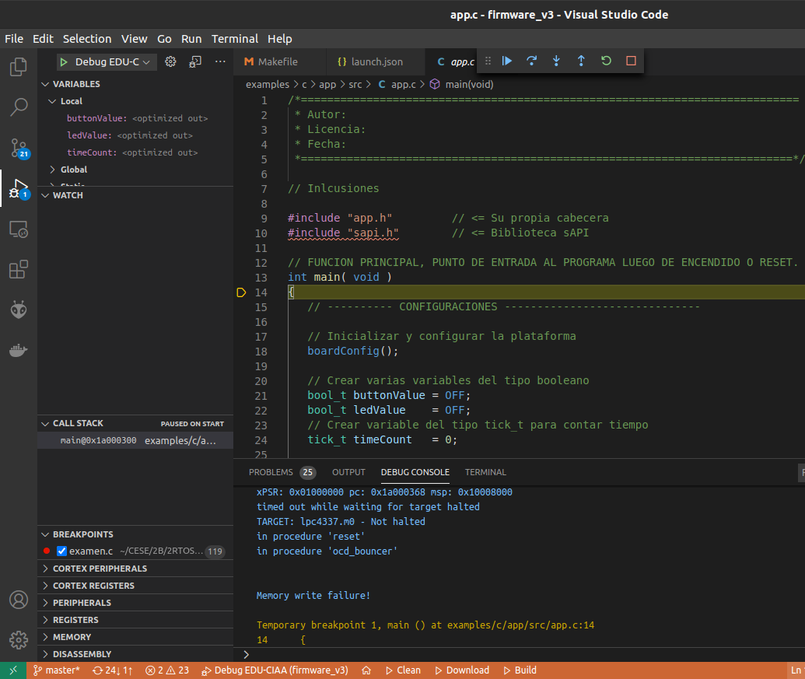

# Utility for EDU-CIAA debugging with VS Code and install quick Launch buttons on Statusbar

We use two Visual Studio Code plugins:

* [Cortex-Debug](https://marketplace.visualstudio.com/items?itemName=marus25.cortex-debug)
* [Tasks Statusbar](https://marketplace.visualstudio.com/items?itemName=hediet.tasks-statusbar)

To use this utility in your project, you have to: 

1. Install the two plugins listed below.
2. Copy the content of the folder *.vscode* on the root folder of your project.
3. Restart VS Code and open the root folder of your project.

## Debugging with CORTEX-DEBUG

**CORTEX-DEBUG** support debugging of ARM Cortex-M Microcontrollers. This plugin use the configuration file *launch.json* (see [https://go.microsoft.com/fwlink/?linkid=830387](https://go.microsoft.com/fwlink/?linkid=830387)). To see more details open the file *.vscode/launch.json*.

Before use this plugin you have to install the programs [**OpenOCD**](http://openocd.org/) and [**GNU Arm Embedded Toolchain**](https://developer.arm.com/tools-and-software/open-source-software/developer-tools/gnu-toolchain/gnu-rm/downloads). After that, you have to edit the attribule "executable" in *.vscode/launch.json* file and write the  location of the *.elf* compiled file:

(We will use "Commands Substitions" in the future and avoid this *ad-hoc* modification).

Now you can use the VS Code menu to RUN/DEBUG the program.

## Using launcher buttons on Statusbar

**Tasks Statusbar** adds buttons to the status bar to quickly start and kill tasks. This extension can be configured by *settings.json* file (see [https://code.visualstudio.com/docs/getstarted/settings#_settings-file-locations](https://code.visualstudio.com/docs/getstarted/settings#_settings-file-locations)). You can see the file *.vscode/settings.json* for more details. 
The tasks are configured on the file *.vscode/tasks.json* (see [https://go.microsoft.com/fwlink/?LinkId=733558](https://go.microsoft.com/fwlink/?LinkId=733558))